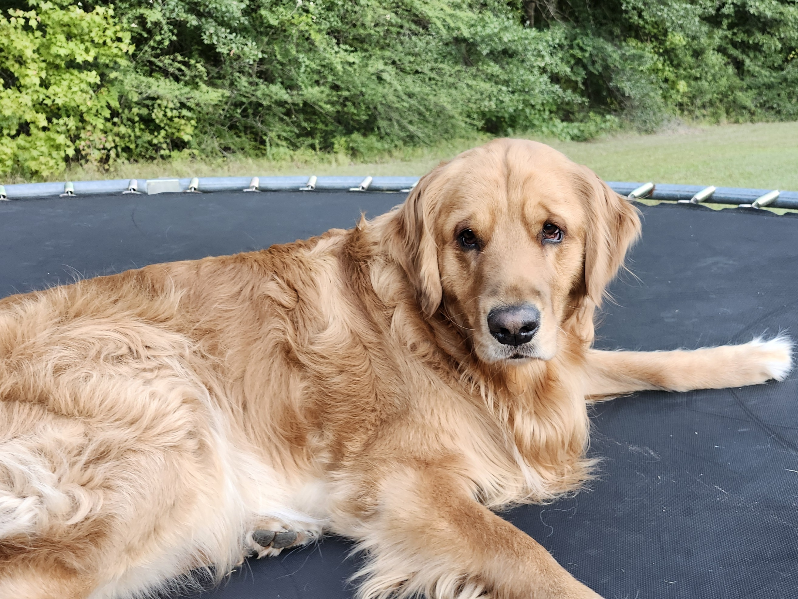

# Python-Experiments

This repository contains the intial code I created when learning to use GitHub as part of DSCI 8133, *Foundations of Data Science* at Mississippi State University.

---
## **Plan**

Future plans for this repository include adding a sample data file and a [Jupyter](https://jupyter.org/) notebook that will interact with the file.

## **About Me**

I am Lynn Taylor, and I work in the Data Science Academic Institute. **Data Science** is becoming one of my passions.

My data science competencies include:
- Computer Applications
- Managing Projects through GitHub
- Python Programming
- Data Wrangling

In order to test the inclusion of a photograph, I've included a photo of my dog Luis laying on a trampoline:

